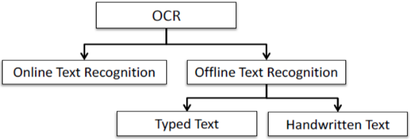
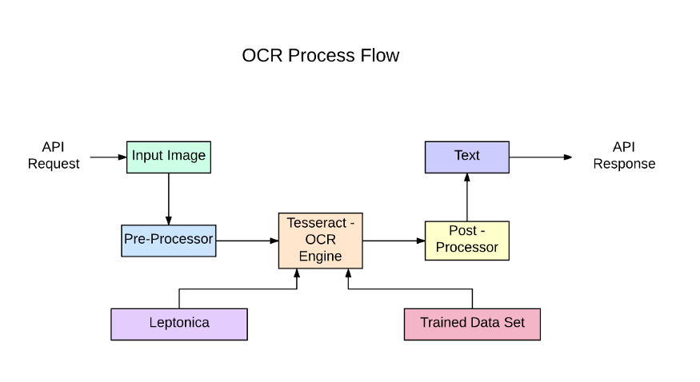
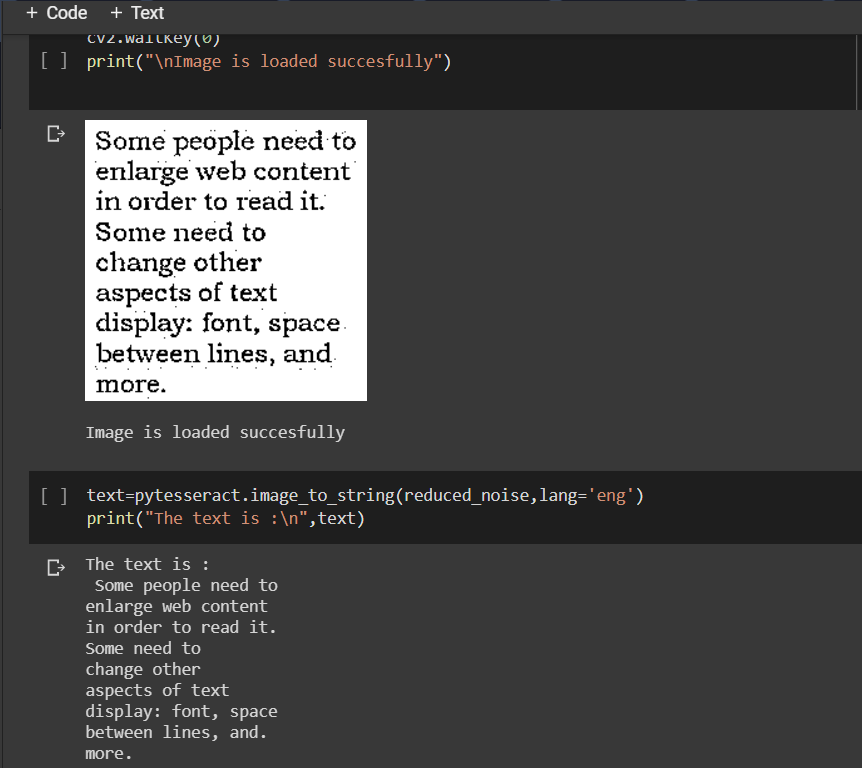

# Optical Character Recognition (OCR)
OCR systems have two categories: online, in which input information is obtained through real-time writing sensors; and offline, in which input information is obtained through static information (images).

## For offline typed text we use PyTesseract.
Python-tesseract is an optical character recognition (OCR) tool for python. That is, it will recognize and “read” the text embedded in images.

Python-tesseract is a wrapper for Google’s Tesseract-OCR Engine. It is also useful as a stand-alone invocation script to tesseract, as it can read all image types supported by the Pillow and Leptonica imaging libraries, including jpeg, png, gif, bmp, tiff, and others. Additionally, if used as a script, Python-tesseract will print the recognized text instead of writing it to a file.

## Output

